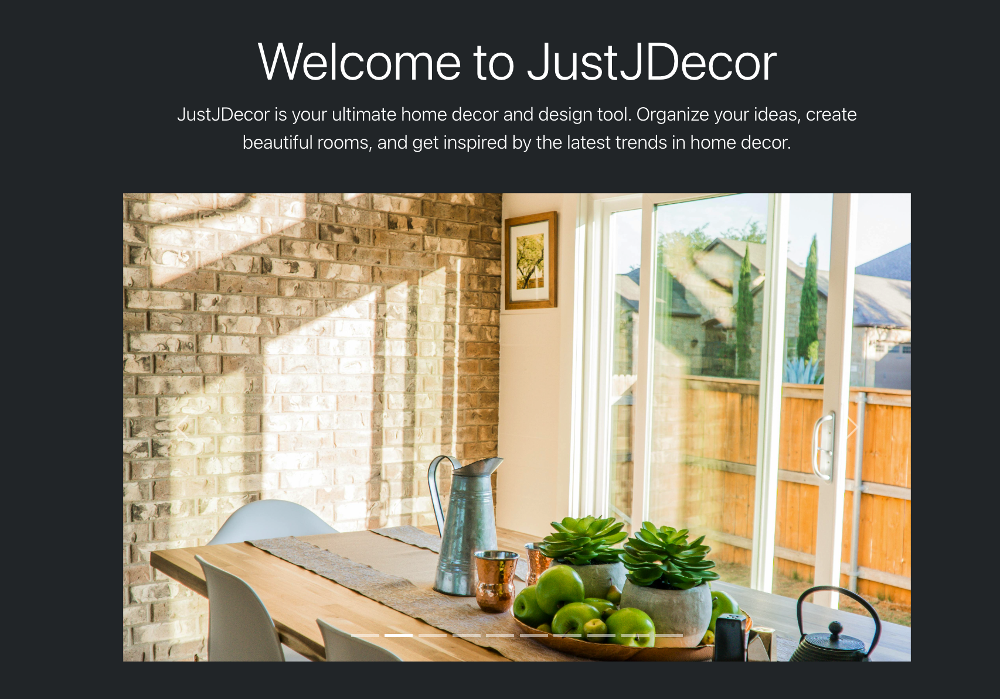

# JustJDecor


JustJDecor is a web application focused towards homeowners to manage home remodeling projects and design ideas.

## Design

#### 1. Design API

- **Description:** Manages rooms, projects, notes, pins, inspiration, wishlist items, and users.
- **Base URL:** `http://localhost:8100`
- **URLS:** "/api/rooms/", "/api/projects/", "/api/notes/", "/api/pins/", "/api/search-inspiration/", "/api/main-photos/"
- **Work In Progress URLS:** "/api/wishlist-items/", "/api/user-profiles/"
- **Port:** `8100`
- **Pexels API Integration**

#### 2. React Frontend

- **Description:** The frontend application for interacting with the Design API.
- **Base URL:** `http://localhost:5173`
- **URLs:** "/rooms/", "/rooms/{roomId}/"/ideas/", "/projects/{roomId}/pins/",
- **Work In Progress URLS:** "/wishlist/", and "/profile/"
- **Port:** `5173`

## Getting Started

### Prerequisites

- Python
- Docker
- Node.js
- Django
- React

### Setup

1. **Clone the Repository**
   ```bash
   git clone https://github.com/jveliquette/JustJDecor.git
   cd JustJDecor
   ```
2. **Start the Microservices**
   ```bash
   docker-compose build
   docker-compose up
   ```
3. **Accessing the Application:**
   The app can be accessed at http://localhost:5173/ in the browser.

### Environment Variables

This project requires the following environment variables to be set in order to view photos in the development phase:

- `PEXELS_API_KEY`: Your Pexels API key. You can obtain one by signing up at [Pexels Developer](https://www.pexels.com/api/).
- `VITE_PEXELS_API_KEY`: Your Pexels API key. (same key as above)

The application requires the key to be defined twice because the backend uses PEXELS_API_KEY, while the frontend, built with Vite, requires VITE_PEXELS_API_KEY for recognition and access to the Pexels API.

To set it, create a `.env` file in the project root with the following content:

```bash
PEXELS_API_KEY=your_actual_api_key
VITE_PEXELS_API_KEY=your_actual_api_key
```

## Design microservice

### Models:

- **Room:** Represents rooms. Includes "name" and "image_url".
- **Project:** Represents projects. Includes "name", "description", "room" (foreign key), and "created_at". Relies on Room Model.
- **Note:** Represents notes. Includes "content", "completed", and "room" (foreign key). Relies on Room Model.
- **Pin:** Represents pins. Includes "title", "image_url", "description", "pinned_at", and "project" (foreign key). Relies on Project Model.

-**Work in Progress:** -**UserProfile:** Represents a user profile. Includes "user" and "bio" -**WishlistItem:** Represents wishlist items. Includes "title", "image_url", "purchase_link", "description", "added_at", "status", "purchase_date", "notes", and "project" (foreign key). Relies on Project Model.

### CRUD Routes:

#### Rooms:

**Create Room**

- **Method:** `POST`
- **URL:** `http://localhost:8080/api/rooms/`
- **Description:** Creates a new room.
- **Request Body:**
  ```json
  {
    "name": "Kitchen",
    "image_url": "https://encrypted-tbn0.gstatic.com/images?q=tbn:ANd9GcSIRPsTcvxL6pKttFk1UV0om2qVaBUrBqS9Bg&s"
  }
  ```
- **Response:**
  `json
  {
"id": 1,
"name": "Kitchen",
"image_url": "https://encrypted-tbn0.gstatic.com/images?q=tbn:ANd9GcSIRPsTcvxL6pKttFk1UV0om2qVaBUrBqS9Bg&s"
  }
  `
  **Read All Rooms**
- **Method:** `GET`
- **URL:** `http://localhost:8080/api/rooms/`
- **Description:** Retrieves a list of all rooms.
- **Request Body:** N/A
- **Response:**
  `json
  {
"rooms": [
	{
		"id": 1,
		"name": "Kitchen",
		"image_url": "https://encrypted-tbn0.gstatic.com/images?q=tbn:ANd9GcSIRPsTcvxL6pKttFk1UV0om2qVaBUrBqS9Bg&s"
	},
]
  }
  `
  **Read Room by ID**
- **Method:** `GET`
- **URL:** `http://localhost:8080/api/rooms/:id/`
- **Description:** Retrieves a specific room by ID.
- **Request Body:** N/A
- **Response:**
  ```json
  {
    "id": 1,
    "name": "Kitchen",
    "image_url": "https://encrypted-tbn0.gstatic.com/images?q=tbn:ANd9GcSIRPsTcvxL6pKttFk1UV0om2qVaBUrBqS9Bg&s"
  }
  ```

**Update a Room**

- **Method:** `PUT`
- **URL:** `http://localhost:8080/api/rooms/:id/`
- **Description:** Updates a specific room by ID.
- **Request Body:**
  ```json
  {
    "name": "Backyard",
    "image_url": "https://encrypted-tbn0.gstatic.com/images?q=tbn:ANd9GcT7HElegB3ioAlItyqG52FoTtIwWLmOpZX9sw&s"
  }
  ```
- **Response:**
  ```json
  {
    "id": 1,
    "name": "Backyard",
    "image_url": "https://encrypted-tbn0.gstatic.com/images?q=tbn:ANd9GcT7HElegB3ioAlItyqG52FoTtIwWLmOpZX9sw&s"
  }
  ```

**Delete a Room**

- **Method:** `DELETE`
- **URL:** `http://localhost:8080/api/rooms/:id/`
- **Description:** Deletes a specific room by ID.
- **Request Body:** N/A
- **Response:**
  ```json
  {
    "deleted": true
  }
  ```

#### Projects:
